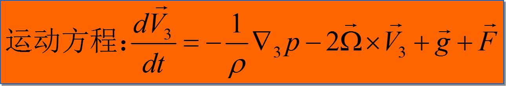
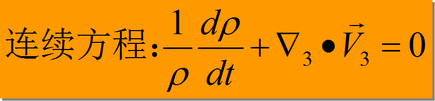
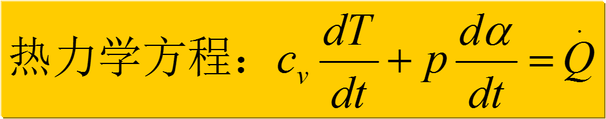
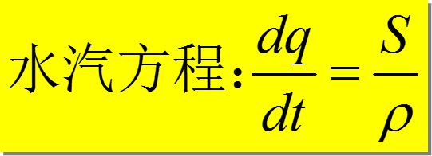
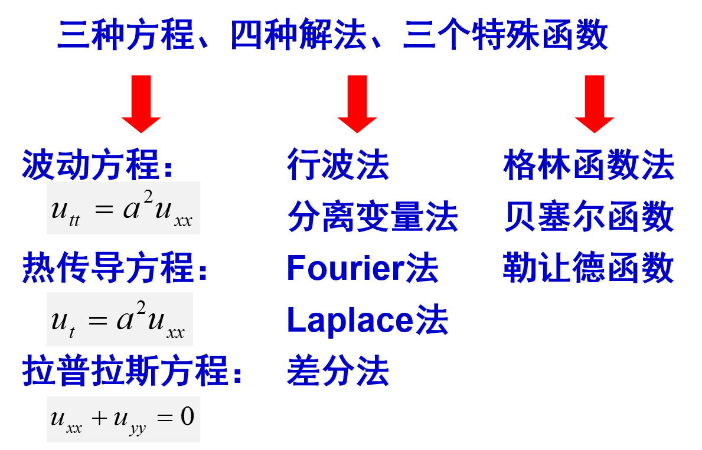

# 一 、本课程教学安排

* 一. 时数: 56(1---14周)
* 二. 学分本课程教学安排: 3.0, 考试课程(考试时间另行通知,平时成绩占30%,包括作业与考勤)，第16周考试，具体时间地点待定。
  <!--more  -->  
* *我院考研课程*
* 三. 答疑时间地点: 双周一下午3~6点，科技楼206
* 四. 参考书目:  
     1 《数学物理方法》胡学刚编，机械工业出版社  
     2 《数学物理方法学习指导》郭玉脆编，清华大学出版社  
     3 《数学物理方法学习指导》刘继军编，科学出版社

# 绪论

### 问题一、什么是数学物理方程？

**数学物理方程**
通常指从物理学及其他各门自然科学、技术科学中所产生的偏微分方程，有时也包括与此有关的积分方程、微分积分方程和常微分方程。
用来描述物理规律（研究的物理量在空间中的分布规律和在时间中的变化规律，物理量：声压、质点位移、温度、电势、电场强度等）

### 问题二、为什么要研究数学物理方程？
描述复杂物理现象、揭示其内在的物理规律。如：声波在一定环境下的传播规律。

在大气科学、海洋科学、工程应用中，对物理规律进行预报：热传播、流体运动等的预报和传递函数的预报。

工程设计需要:比如超声换能器设计，声纳设计预报。
### 数值天气预报的基本方程组

#### 预报网址
http://nmc.gov.cn/

http://www.grapes-trams.org.cn/

http://old.ecmwf.int/products/forecasts/d/charts
# 二、 本课程讲授内容
* 第1章  典型数学物理方程及定解问题
* 第2章  偏微分方程的分类和标准型
* 第3章  行波法(d’Alembert公式法)
* 第4章  分离变量法(驻波法)
* 第5章  Fourier积分变换法
* 第6章  Laplace积分变换法
* 第7章  数学物理方程差分解法

# 三种方程、四种解法、三个特殊函数

